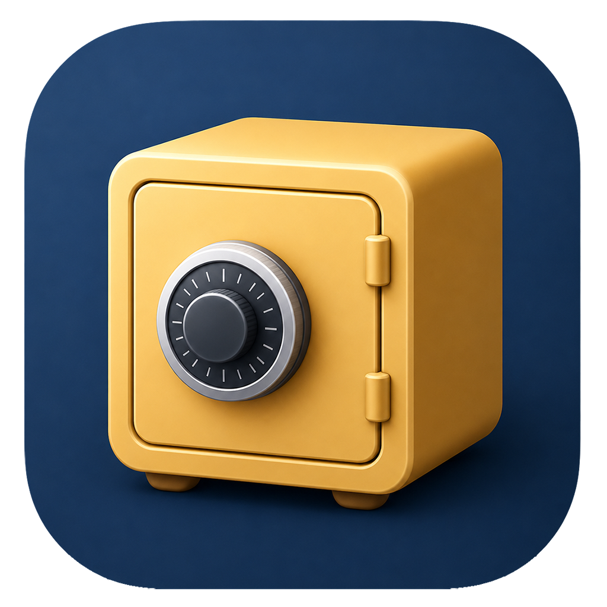

<p align="center">
  
</p>

# Passdroid Next

A modern, cross-platform password vault built with **Tauri 2 + React + Rust**. It is the
successor to the original [Passdroid](https://github.com/mangefoo/passdroid) Android app — this
repository keeps that app's git history as the origin point but is otherwise a brand-new
application. It ships as a desktop app (Windows/macOS/Linux) and an Android app from a single
codebase.

Secrets never touch a database or plaintext file: the vault is a single encrypted `.pdvault`
file. On desktop you keep it wherever you like (including a folder synced by Google Drive,
Dropbox, OneDrive, Syncthing, Nextcloud or an SMB share); on Android it lives in the app's
private storage and syncs across devices over the built-in FTP sync.

## Features

- **Vault management** — create, unlock and lock vaults; add / edit / delete entries (title,
  username, password, URL, notes) with instant search.
- **Password generator** — length plus upper/lower/number/symbol toggles.
- **Per-vault icon** — choose an icon from a curated set; it is stored inside the vault (so it
  syncs across devices) and shown on the start, unlock and vault screens.
- **Remote sync over FTP** — optional. On open, if the server copy is newer it offers to download
  and merge it; after each change it pushes, merging by `id` / `updated_at` (see *Remote sync*).
- **Recent vaults** — re-open quickly from the start screen (shown by name).
- **Import** — migrate from the original Passdroid app (cleartext XML, encrypted `sqt`, or a
  `password.db` SQLite database).
- **Export** — an encrypted `.pdvault` copy, or a legacy-compatible (unencrypted) XML.
- **Security hardening** — screenshots / screen-recording are blocked and the recents thumbnail is
  blanked (Android `FLAG_SECURE`); the vault auto-locks when the app goes to the background and
  asks for that vault's master password again on return.
- **UX** — light / dark / system themes, Spanish / English, copy username & password, open a valid
  URL in the browser, responsive desktop layout with a full-screen entry editor on mobile.

## Security model

- **Key derivation:** Argon2id (RFC 9106). Defaults: 64 MiB memory, 3 iterations, parallelism 1,
  16-byte random salt, 32-byte key. Android builds use 32 MiB. Parameters are stored per-vault in
  the header, so a vault stays openable on any device regardless of where it was created.
- **Encryption:** XChaCha20-Poly1305 (AEAD). The visible JSON header is authenticated as
  associated data (AAD), so tampering with it is detected.
- **At rest:** derived keys are wrapped in `zeroize` and wiped on lock.
- **Device protection (Android):** `FLAG_SECURE` blocks screenshots / screen recording and blanks
  the app preview in the recents switcher; the vault auto-locks on background and requires the
  master password again on return.
- **Sync conflicts:** when syncing, both revisions are decrypted and merged per `entry.id` /
  `updated_at`. A genuine clash on the same entry produces a duplicate marked as a conflict
  instead of losing data.

### Vault file format (`passdroid-vault-v1`)

```jsonc
{
  "header": {            // visible, authenticated as AAD
    "magic": "passdroid-vault-v1",
    "version": 1,
    "vaultId": "...",
    "kdf": { "algorithm": "Argon2id", "memoryKib": 65536, "iterations": 3, ... },
    "cipher": { "algorithm": "XChaCha20-Poly1305" },
    "nonce": "<base64>",
    "createdAt": "...", "updatedAt": "..."
  },
  "payload": "<base64 XChaCha20-Poly1305 ciphertext>"  // encrypts { entries, revision, deviceId, settings }
}
```

## Prerequisites

- [Rust](https://www.rust-lang.org/tools/install) (stable) and Cargo
- [Node.js](https://nodejs.org/) 20+ and npm
- Tauri system dependencies — see the [Tauri prerequisites](https://v2.tauri.app/start/prerequisites/)
- For Android: Android SDK + NDK, with `ANDROID_HOME`/`NDK_HOME` set, and minimum SDK 24

## Desktop

```bash
npm install
npm run tauri:dev      # run with hot reload
npm run tauri:build    # produce a desktop bundle
```

`npm run dev` / `npm run build` run only the web frontend (Vite on port 1420).

## Android

The Android Gradle project is generated under `src-tauri/gen/android`.

```bash
npm run tauri:android:init    # one-time; regenerates src-tauri/gen/android
npm run tauri:android:dev     # run on a device/emulator
npm run tauri:android:build   # build an APK/AAB
```

> The generated `gen/android` source tree is committed so a clean checkout builds without
> re-running `init`; only build outputs (`build/`, `.gradle/`, native `*.so`) are git-ignored.
> Re-run `init` only when bumping the Tauri Android template.

## Legacy import (migration)

Settings → **Import Passdroid** reads an old Passdroid export or database, decrypts it in memory
with the old password, shows a preview, and lets you commit the entries into the current
(modern) vault. Supported sources:

- Cleartext `passdroid_db.xml` exports
- Encrypted exports (the `sqt`-magic AES-CBC format)
- `password.db` SQLite databases (Passdroid 2.x: `system` + `data` tables)

The legacy crypto lives only in `src-tauri/src/legacy.rs` and is never used to create new data.

## Remote sync

The vault is a single encrypted file, so it syncs as a blob.

- **Built-in FTP sync** (Settings → *Sync*): connection settings (host, port, user, password,
  folder, file name) are stored **encrypted inside the vault**, protected by your master password.
  When you open a vault, if the server copy is newer the app offers to **download and merge** it;
  after every change it pushes the merged result, reconciling by `id` / `updated_at`. On upload it
  also drops a deny-all `.htaccess` next to the vault so the folder is never served over the web.

  > Plain FTP transmits the login in clear text — the vault *content* stays encrypted
  > (XChaCha20-Poly1305), but use a **dedicated, least-privilege FTP account**. FTPS/SFTP is a
  > planned hardening step.

- **On Android** the vault lives in the app's private storage (a real, always-accessible path —
  Android revokes Storage-Access-Framework permissions on restart, so a picked Documents/Drive
  file can't be reopened reliably). *Import vault* copies a picked file in once; FTP then keeps
  every device in sync. Use *Export* if you want a copy back in Documents.

- **On desktop** you can alternatively skip FTP and keep the `.pdvault` in a folder synced by
  [Syncthing](https://syncthing.net/), Dropbox, OneDrive, Nextcloud, etc.

## Testing

```bash
cd src-tauri
cargo test       # crypto, KDF, vault lifecycle, merge/conflict, legacy import fixtures
cargo clippy --all-targets
```

```bash
npm run build    # type-checks the frontend (tsc) and builds it
```

## License & attribution

Passdroid Next is licensed under the **GNU GPL v3 or later** (`LICENSE.TXT`). The legacy
migration code in `src-tauri/src/legacy.rs` reimplements the on-disk crypto of the original
Passdroid app (Copyright © 2009–2012 Magnus Eriksson), reused under GPLv3. The Tauri structure
is inspired by, but not copied from, the MIT-licensed Syncdrome reference project.
